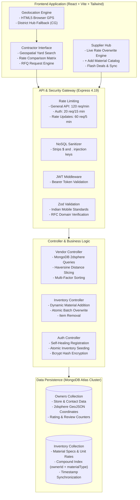
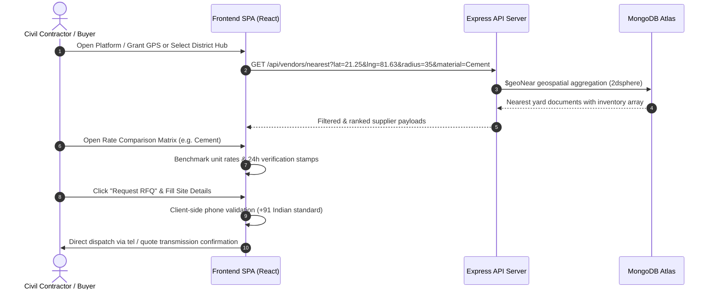
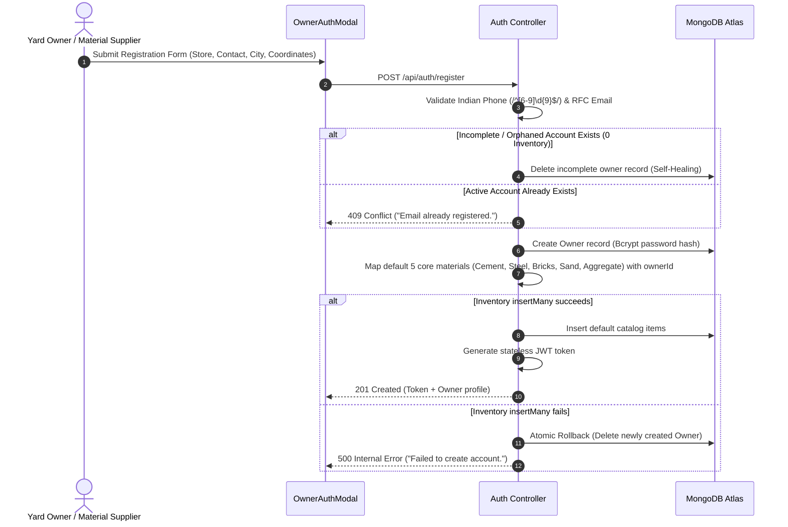
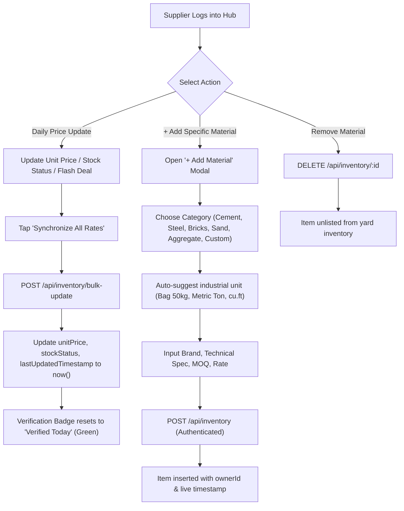

# STRUCT // Chhattisgarh Hyperlocal Construction Materials Exchange

A high-performance, full-stack B2B civil procurement platform connecting building contractors, site engineers, and infrastructure developers directly with verified steel depots, cement plants, sand ghats, and stone quarry operators across Chhattisgarh.

The platform eliminates intermediary brokerage, delivers real-time daily price transparency for heavy structural commodities, and calculates haulage distances to active construction sites using geospatial indexing.

---

## System Architecture



---

## Core Operational Workflows

### 1. Contractor Sourcing & RFQ Dispatch Flow



### 2. Supplier Registration & Inventory Initialization Flow



### 3. Supplier Daily Rate Overwrite & Dynamic Catalog Flow



---

## Regional Logistics Hubs (Chhattisgarh)

The platform is calibrated for the industrial geography of Chhattisgarh:

| District / Hub | Focus Commodities | Primary Transit Corridor | Key Industrial Benchmark |
| :--- | :--- | :--- | :--- |
| **Bhilai / Durg** | Primary Mill TMT Rebars, Structural Steel, Slag Cement | NH-53 (Great Eastern Road) | Bhilai Steel Plant (SAIL), ACC Jamul |
| **Raipur** | Cement Wholesaling, Secondary TMT, Red Bricks, River Sand | Ring Road No. 1 & 2 / NH-30 | Urla & Bhanpuri Industrial Estates |
| **Bilaspur** | PPC Cement, Railway Grade Aggregate, Fly Ash Bricks | Sirgitti / NH-130 Corridor | Hirmi / Rawan Clinker Belt, Mahanadi Basin |
| **Korba** | Thermal Power Fly Ash, Concrete Blocks, Heavy Masonry | Korba - Champa Energy Highway | Power Generation Ash Corridors |
| **Raigarh** | Sponge Iron, Billets, High-Tensile Structural Steel | Jindal Steel Industrial Belt | OP Jindal Industrial Corridor |
| **Rajnandgaon** | Stone Aggregate, River Coarse Sand, Masonry Supplies | Somni Industrial Area | Western CG Logistics Junction |

---

## Feature Matrix

### Contractor & Buyer Tools
- **Geospatial Proximity Filtering**: Bounded search queries (15 km, 25 km, 35 km, 50 km, 100 km radius) powered by MongoDB spherical coordinates (`@2dsphere`).
- **Commodity Category Tabs**: Instant filtering across Cement, Steel/TMT, Bricks/Blocks, Sand, Aggregate, and Custom Yard Products.
- **Side-by-Side Rate Matrix**: Direct comparison grid ranking all operational yards in the sector by lowest unit rate, distance, and verification status.
- **Audit Verification Badges**:
  - `Verified Today` (Green): Rates updated and synchronized within the last 24 hours.
  - `Stale Notice` (Red/Amber): Rates older than 24 hours — instructs contractors to re-confirm before dispatch.
- **Direct RFQ Generator**: Instant quote modal capturing exact job-site location, quantity requirements, and contractor contact info.
- **Supplier Rating System**: Client scoring engine (1 to 5 stars) dynamically updating aggregate ratings and review counts without page reloads.

### Supplier Hub Operations
- **Spreadsheet-Speed Rate Engine**: Live table allowing yard operators to modify unit prices, toggle stock availability (`In Stock`, `Limited Stock`, `Out of Stock`, `Bulk Available`), and activate flash deals.
- **Dynamic Catalog Builder**: "+ Add Material" modal with auto-suggested measurement units (`Bag 50kg`, `Metric Ton`, `cu.ft`, `Per Piece`) and technical spec templates.
- **Live Verification Timestamping**: One-click sync that updates database timestamps and marks yard pricing as verified for the construction sector.
- **Anti-Fake Validation**: Protects supplier databases by rejecting fake phone numbers and placeholder email domains upon registration.

---

## Technology Stack

```
Frontend:
├── React 18.3 (Component-driven architecture)
├── Vite 5.4 (High-speed module bundling)
├── Tailwind CSS 3.4 (Modern curved styling system)
├── Lucide React (Industrial vector iconography)
└── Axios (Configured client with automatic auth headers)

Backend:
├── Node.js 20+ (Runtime)
├── Express.js 4.19 (REST routing & middleware)
├── MongoDB Atlas (Managed cloud database)
├── Mongoose 8.7 (ODM with 2dsphere indexing)
├── Zod 3.23 (Runtime schema validation)
├── JSON Web Tokens (Stateless authentication)
├── Bcryptjs (10 salt rounds password hashing)
└── Express Rate Limit (Tiered request throttling)
```

---

## Security & Data Integrity Audit

| Vector | Mitigation Strategy | Implementation Details |
| :--- | :--- | :--- |
| **Phone Validation** | Telecom Standard Regular Expression | Strictly requires 10-digit Indian numbers starting with `[6-9]`. Rejects repetitive sequences (`9999999999`), sequential runs (`1234567890`), and short inputs (`55556526`). Normalizes to `+91 XXXXX XXXXX`. |
| **Email Validation** | RFC Syntax + Domain Blacklist | Rejects malformed structures and blocks disposable/placeholder domains (`fake.com`, `test.com`, `asdf.com`, `tempmail.com`). |
| **NoSQL Injection** | Recursive Key Sanitization | Strips all keys containing `$` and `.` operators before requests enter controller logic. |
| **Password Storage** | One-Way Cryptographic Hash | Passwords hashed via Bcrypt (10 salt rounds). Model excludes password field by default (`select: false`). |
| **Rate Throttling** | Multi-Tiered Express Rate Limiter | General API (120 req/min), Auth endpoints (20 req/15 min), Price update endpoints (60 req/5 min). |
| **Atomic Rollback** | Transactional Error Handling | Registration failure during catalog setup immediately deletes the newly created Owner document to avoid orphaned records. |
| **Self-Healing Auth** | Incomplete Registration Recovery | Registration requests encountering existing records with zero inventory automatically purge the stale record and complete fresh registration. |

---

## API Reference

### Public / Contractor Endpoints

#### Health Check
```http
GET /api/health
```
- **Response**: `200 OK`
```json
{ "status": "ok", "timestamp": "2026-09-23T00:00:00.000Z" }
```

#### Nearest Suppliers Query
```http
GET /api/vendors/nearest?lat=21.25&lng=81.63&radius=35&material=Cement&sort=distance_asc&search=UltraTech
```
- **Query Parameters**:
  - `lat` (number, required): Contractor latitude.
  - `lng` (number, required): Contractor longitude.
  - `radius` (number, optional, default: `35`): Max search perimeter in kilometers.
  - `material` (string, optional): Filter by commodity (`Cement`, `Steel/Saria`, `Bricks`, `Sand`, `Aggregate`).
  - `sort` (string, optional): `distance_asc`, `price_asc`, `rating_desc`, `flash_deals`.
  - `search` (string, optional): Text match on store name, brand, or locality.

#### Rate a Supplier
```http
POST /api/vendors/:id/rate
Content-Type: application/json

{ "score": 5 }
```
- **Response**: `200 OK` with updated `rating` and `reviewCount`.

---

### Authentication Endpoints

#### Supplier Registration
```http
POST /api/auth/register
Content-Type: application/json

{
  "storeName": "Raipur Building Depot",
  "contactPerson": "Ramesh Kumar",
  "contact": "9827112345",
  "email": "ramesh.depot@example.com",
  "password": "securePassword123",
  "physicalAddress": "Ring Road No. 2, Gondwara",
  "city": "Raipur",
  "pincode": "492001",
  "gstNumber": "22AABCR1234F1Z9",
  "operationalRadiusKm": 45,
  "latitude": 21.2514,
  "longitude": 81.6296
}
```

#### Supplier Login
```http
POST /api/auth/login
Content-Type: application/json

{
  "email": "bhilai.steel@example.com",
  "password": "password123"
}
```

---

### Supplier Inventory Endpoints (Authenticated — Bearer Token Required)

#### Fetch Supplier Catalog
```http
GET /api/inventory
GET /api/inventory/my-inventory
Authorization: Bearer <TOKEN>
```

#### Add Specific Material
```http
POST /api/inventory
Authorization: Bearer <TOKEN>
Content-Type: application/json

{
  "materialType": "Cement",
  "brand": "Ambuja Kawach PPC",
  "spec": "Water-Repellent Grade 53 Blended Cement",
  "unitPrice": 380,
  "unit": "Bag (50kg)",
  "stockStatus": "In Stock",
  "minOrderQty": 50,
  "flashDeal": {
    "active": true,
    "discountPercent": 5,
    "bannerText": "Direct Depot Promo"
  }
}
```

#### Overwrite Single Material Price
```http
PUT /api/inventory/:id
Authorization: Bearer <TOKEN>
Content-Type: application/json

{
  "unitPrice": 375,
  "stockStatus": "Limited Stock"
}
```

#### Bulk Overwrite Rates
```http
POST /api/inventory/bulk-update
Authorization: Bearer <TOKEN>
Content-Type: application/json

{
  "items": [
    {
      "id": "60d0fe4f5311236168a109ca",
      "unitPrice": 370,
      "stockStatus": "In Stock",
      "flashDealActive": false
    }
  ]
}
```

#### Delete Material from Yard Catalog
```http
DELETE /api/inventory/:id
Authorization: Bearer <TOKEN>
```

---

## Pre-Configured Demo Accounts

The database comes pre-seeded with operational suppliers across Chhattisgarh. You can log into any of these accounts in the **Supplier Hub** to test rate overwrites and catalog additions:

| Supplier Yard Name | Email | Password | Hub & State | Delivery Fleet |
| :--- | :--- | :--- | :--- | :--- |
| **Bhilai Ispat & TMT Steel Depot** | `bhilai.steel@example.com` | `password123` | Bhilai, CG (490026) | Yes |
| **Mahanadi Building Materials & UltraTech Hub** | `mahanadi.materials@example.com` | `password123` | Bilaspur, CG (495004) | Yes |
| **Raipur Mega Cement & Infrastructure Depot** | `raipur.infra@example.com` | `password123` | Raipur, CG (492001) | Yes |
| **Korba Power Ash & Masonry Products** | `korba.ash@example.com` | `password123` | Korba, CG (495677) | Yes |
| **Raigarh Steel & Regional Building Yard** | `raigarh.steel@example.com` | `password123` | Raigarh, CG (496001) | Yes |

---

## Installation & Setup

### Prerequisites
- **Node.js**: v18.0.0 or higher
- **Python**: 3.8+ (for one-click local launcher)
- **MongoDB Atlas** account (or local MongoDB v6.0+)

### Option A: One-Click Local Launcher (Recommended)

Run the included automated Python launcher from the repository root:

```bash
python run_local.py
```

This script:
1. Validates Node.js runtime availability.
2. Automatically builds the production frontend (`npm run build`) if not already present.
3. Launches the unified Express server on `http://localhost:5000`.
4. Tests `/api/health` connectivity.
5. Launches your default web browser directly to the application.

---

### Option B: Manual Development Setup

#### 1. Configure Environment Variables
Create or verify `backend/.env`:

```env
PORT=5000
NODE_ENV=development
MONGODB_URI=mongodb+srv://<USER>:<PASS>@cluster0.fxbujjd.mongodb.net/hyperlocal_construction?retryWrites=true&w=majority
JWT_SECRET=struct_chhattisgarh_secret_jwt_key_2026
JWT_EXPIRES_IN=7d
CORS_ORIGIN=http://localhost:5173
```

#### 2. Install Dependencies
```bash
# Backend dependencies
cd backend
npm install

# Frontend dependencies
cd ../frontend
npm install
```

#### 3. Seed Database (Optional)
```bash
cd backend
node src/utils/seedData.js
```

#### 4. Run Development Servers
```bash
# Terminal 1 - Backend API Server
cd backend
npm run dev

# Terminal 2 - Frontend Vite Dev Server
cd frontend
npm run dev
```

The frontend will run at `http://localhost:5173` and proxy API calls to port `5000`.

---

## Production Deployment Build

To package the entire platform for single-server production deployment (e.g. Render, Railway, AWS EC2):

```bash
# 1. Build frontend assets into backend-served static bundle
cd frontend
npm run build

# 2. Start unified production server
cd ../backend
node src/server.js
```

The Express server serves the compiled Single Page Application (`frontend/dist`) for all standard browser routes while maintaining the active `/api/*` endpoints on port `5000`.

---

## Directory Structure

```
avishkar/
├── run_local.py                 # Automated cross-platform local runner
├── README.md                    # Project documentation & engineering specifications
├── backend/
│   ├── .env                     # Server environment credentials
│   ├── package.json             # Backend dependencies & scripts
│   └── src/
│       ├── server.js            # Express app entry & static SPA serving
│       ├── config/
│       │   └── db.js            # Mongoose MongoDB connection & pool setup
│       ├── controllers/
│       │   ├── authController.js       # Register, login & self-healing catalog setup
│       │   ├── inventoryController.js  # Add, update, bulk-sync, & delete items
│       │   └── vendorController.js     # Geospatial queries, distance sorting & reviews
│       ├── middleware/
│       │   ├── authMiddleware.js       # JWT bearer token verification
│       │   ├── rateLimiter.js          # Express rate limiting tiers
│       │   ├── sanitizeMiddleware.js   # Recursive NoSQL injection sanitization
│       │   └── validateMiddleware.js   # Zod request validation wrapper
│       ├── models/
│       │   ├── Inventory.js     # Material schema with compound indexing
│       │   └── Owner.js         # Yard profile with GeoJSON 2dsphere indexing
│       ├── routes/
│       │   ├── authRoutes.js    # Auth endpoints mount
│       │   ├── inventoryRoutes.js # Inventory CRUD endpoints mount
│       │   └── vendorRoutes.js  # Public marketplace endpoints mount
│       └── utils/
│           ├── seedData.js      # Chhattisgarh regional hubs & sample suppliers
│           └── validationHelpers.js # Indian phone & RFC email validators
└── frontend/
    ├── index.html               # SPA HTML entry point
    ├── package.json             # Frontend dependencies & Vite scripts
    ├── tailwind.config.js       # Custom curved radius system & color palette
    ├── vite.config.js           # Vite build pipeline & dev proxy
    └── src/
        ├── App.jsx              # Main marketplace container & modal coordination
        ├── index.css            # Base stylesheet & font imports
        ├── main.jsx             # React DOM root entry
        ├── components/
        │   ├── common/
        │   │   ├── GeolocationModal.jsx   # HTML5 GPS prompt modal
        │   │   ├── LocationFallback.jsx   # Manual district hub selector
        │   │   └── VerificationBadge.jsx  # Daily sync freshness indicator
        │   ├── layout/
        │   │   └── Header.jsx             # Role switcher & navigation bar
        │   ├── marketplace/
        │   │   ├── FilterBar.jsx          # Commodity filters, search, & sorting
        │   │   ├── MaterialCompareMatrix.jsx # Side-by-side price comparison modal
        │   │   ├── RfqModal.jsx           # Contractor quote request modal
        │   │   └── VendorCard.jsx         # Yard card with high-density inventory table
        │   └── portal/
        │       ├── OwnerAuthModal.jsx     # Supplier login & yard registration
        │       ├── OwnerInventoryView.jsx # Supplier portal layout
        │       └── PriceUpdateEngine.jsx  # Spreadsheet-style rate overwriting & +Add Material
        ├── context/
        │   ├── AuthContext.jsx  # Supplier authentication state
        │   └── GeoContext.jsx   # Client coordinate tracking & regional presets
        ├── services/
        │   └── api.js           # Configured Axios instance with interceptors
        └── utils/
            └── validation.js    # Client-side validation utilities
```

---

## License

This software is released under the **MIT License**. Standard industrial and commercial use permitted.
